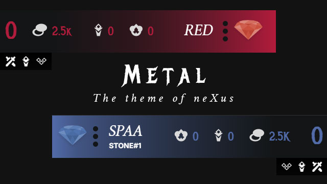

# Metal - The theme of nuXus

[[English](./Readme.md), 日本語]

## インストール方法

`Releases` から最新の ZIP ファイルをダウンロードしてください。そして、nuXus アプリの`テーマ`画面の`テーマを追加`ボタンを押してインストールしてください。

## ライセンス

MIT (詳しくは`LICENSE`ファイルを参照)
